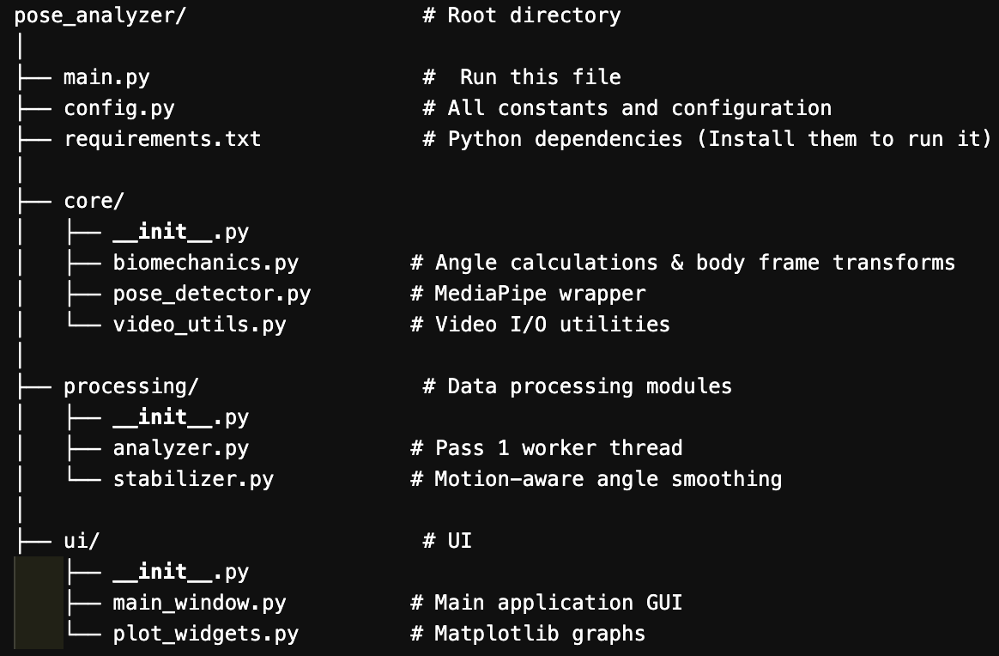

# Usage Guide

## First Time Setup

### Launch Application
Open the folder and go to the pose_analysis directory and run
```bash
python main.py
```

Then
```bash
Select Video
Click the Video button

Choose your motion capture video

Select Model
Click the Model button

Choose your .task model file

Choose View Mode
Frontal: For front-facing videos (adduction, valgus)

Sagittal: For side-view videos (flexion, extension)

Choose Processing Mode
Real-time + Graphs: Slower, shows live graphs

Fast Playback (CSV): Requires analysis first, plays at full speed
```

# Workflow Option 1: Fast Playback
```bash
Click Analyze (Pass 1)

Processes entire video once

Saves results to CSV

May take a few minutes

Click ▶ Play (Pass 2)

Plays at normal video speed

Shows skeleton overlay

Updates graphs in real-time

```
# Workflow Option 2: Real-time Analysis
```bash
Select "Real-time + Graphs" mode

Click ▶ Play

Processes video on-the-fly

Shows graphs immediately

Slightly slower but no pre-processing needed
```
